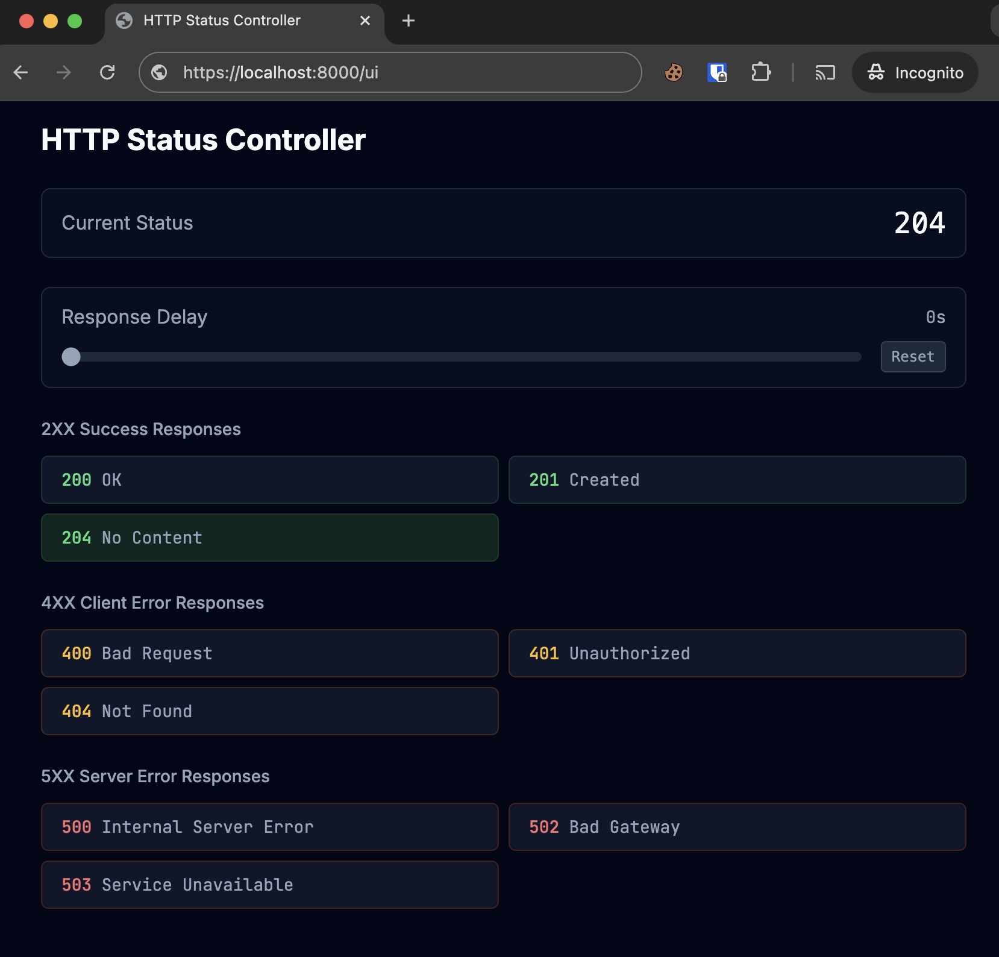

# HTTP Status Simulator

HTTP server with configurable response codes and delays for testing client behaviors.



- Status code simulation (2XX, 3XX, 4XX, 5XX)
- Configurable response delays
- Web interface
- RESTful API endpoints

## Use Cases

- Test error handling in frontend applications
- Simulate API failures and edge cases
- Debug HTTP client implementations
- Verify retry mechanisms and fallbacks
- Test loading states and error boundaries
- Validate HTTP client timeout handling

## API

### Core Endpoints

```
GET    /                    Returns current status with delay
POST   /setStatus          Sets status code
POST   /config/delay       Sets global delay in milliseconds
GET    /ui                 Web interface
```

### Response Format
```json
{
  "status": number,
  "message": string,
  "timestamp": string,
  "delay": number
}
```

### Status Endpoints

Direct access to specific status codes:
- Success: `/200`, `/201`, `/202`, `/204`
- Redirect: `/301`, `/302`, `/307`, `/308`
- Client Error: `/400`, `/401`, `/403`, `/404`, `/409`, `/429`
- Server Error: `/500`, `/501`, `/502`, `/503`, `/504`

## Web Interface

```bash
# Local access
open http://localhost:8000/ui
```

## Testing Examples

### Status Codes
```bash
# Basic status check
curl http://localhost:8000/

# Set custom status
curl -X POST http://localhost:8000/setStatus \
  -H "Content-Type: application/json" \
  -d '{"status": 404}'

# Direct status access
curl http://localhost:8000/418
```

### Delay Testing
```bash
# Set global delay (5 seconds)
curl -X POST http://localhost:8000/config/delay \
  -H "Content-Type: application/json" \
  -d '{"delay": 5000}'

# Test with AbortController
const controller = new AbortController();
const timeout = setTimeout(() => controller.abort(), 2000);

try {
  await fetch('http://localhost:8000/200', {
    signal: controller.signal
  });
} catch (error) {
  if (error.name === 'AbortError') {
    console.log('Request timed out');
  }
}
```

### Error Handling
```typescript
// Retry logic example
async function fetchWithRetry(url: string, retries = 3) {
  for (let i = 0; i < retries; i++) {
    try {
      const res = await fetch(url);
      if (res.ok) return res.json();
      if (res.status !== 429) throw new Error(`HTTP ${res.status}`);
      await new Promise(r => setTimeout(r, 1000 * Math.pow(2, i)));
    } catch (e) {
      if (i === retries - 1) throw e;
    }
  }
}
```

### Request Logging

All requests are logged to `requests.csv` with the following information:
- Timestamp (ISO format)
- HTTP Method
- Request Path
- Full URL (including protocol, host, path, and query string)
- Query Parameters (JSON format)
- Response Status
- Client IP
- User Agent
- Response Time (ms)

```

## Development

```bash
# Install
npm install

# Start server
npm start

# Expose with ngrok
ngrok http 8000
```

## License

MIT
